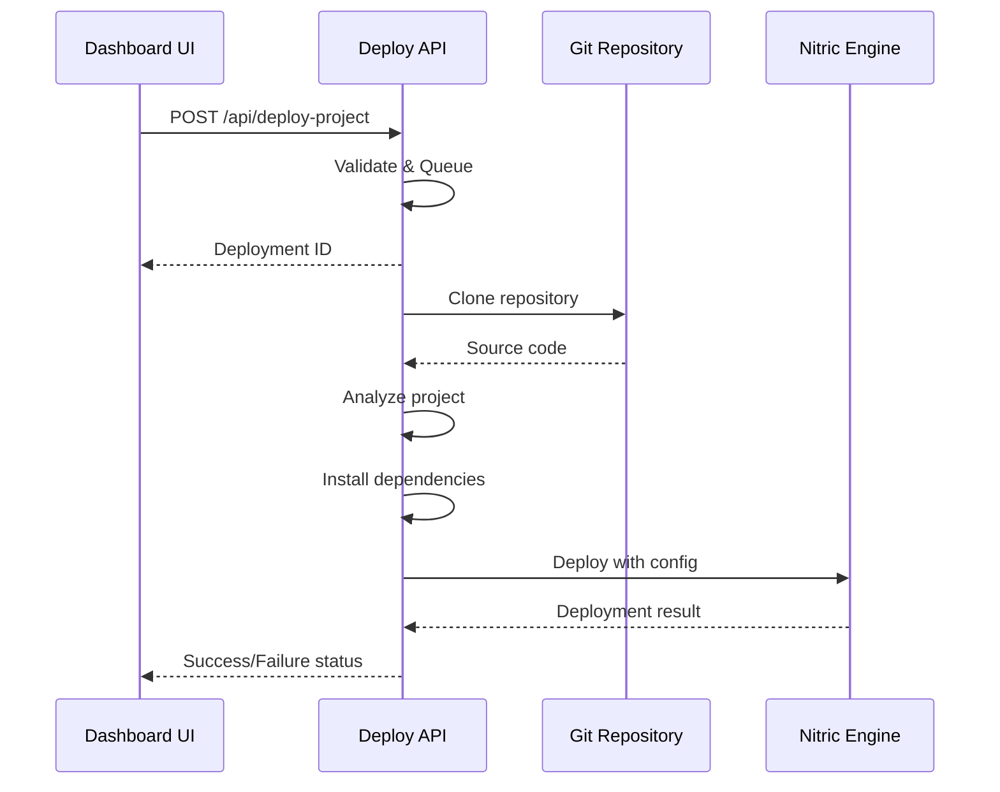

# 🚀 LLM Projects Dashboard - Deployment Guide

## Overview

The LLM Projects Dashboard is an enhanced web application that showcases 500+ AI/ML projects with integrated deployment capabilities using Nitric framework. This deployment guide covers both local development and GitHub Pages hosting.

## 🌟 Features

- **📊 Project Browser**: Browse 500+ curated AI/ML projects
- **🚀 One-Click Deployment**: Deploy GitHub repositories using Nitric
- **📈 Real-time Monitoring**: Track deployment status and logs
- **🎯 GitHub Pages Support**: Static hosting with enhanced metadata
- **🔍 Smart Search**: Filter and categorize projects
- **💡 Performance Optimized**: Efficient loading and error handling

## 🛠 Quick Start

### Option 1: GitHub Pages (Recommended for Viewing)

1. **Enable GitHub Pages**:
   ```bash
   # Go to Repository Settings > Pages
   # Select "Deploy from a branch"
   # Choose "main" branch and "/docs" folder
   ```

2. **Access Dashboard**:
   - URL: `https://scarmonit-creator.github.io/LLM/`
   - Features: Project browsing, metadata viewing
   - Note: Deployment features disabled in GitHub Pages mode

### Option 2: Local Development (Full Features)

1. **Prerequisites**:
   ```bash
   node --version  # v18+ required
   npm --version   # v8+ required
   git --version   # v2.25+ required
   ```

2. **Clone Repository**:
   ```bash
   git clone https://github.com/scarmonit-creator/LLM.git
   cd LLM
   ```

3. **Install Dependencies**:
   ```bash
   npm install
   ```

4. **Start Development Server**:
   ```bash
   npm start
   # or
   node server-dashboard.js
   ```

5. **Access Dashboard**:
   - Main Dashboard: http://localhost:8080/
   - Projects Dashboard: http://localhost:8080/projects-dashboard.html
   - Knowledge Dashboard: http://localhost:8080/knowledge-dashboard.html
   - API Status: http://localhost:8080/api/status

## 🎯 Deployment Architecture

```
┌─────────────────┐    ┌──────────────────┐    ┌─────────────────┐
│   Frontend      │    │   Express.js     │    │   Nitric        │
│   Dashboard     │◄──►│   API Server     │◄──►│   Deployment    │
│                 │    │                  │    │   Engine        │
├─────────────────┤    ├──────────────────┤    ├─────────────────┤
│ • Project View  │    │ • Deploy API     │    │ • Git Clone     │
│ • Status Track  │    │ • Status Track   │    │ • Dependency    │
│ • Real-time UI  │    │ • Log Stream     │    │ • Build & Test  │
│ • GitHub Pages  │    │ • Performance    │    │ • Service Run   │
└─────────────────┘    └──────────────────┘    └─────────────────┘
```

## 📁 Project Structure

```
LLM/
├── 📄 Projects.json              # Project database with metadata
├── 🖥️ server-dashboard.js        # Enhanced Express server
├── 📁 api/
│   └── deploy-project.js         # Optimized deployment API
├── 📁 website/
│   ├── projects-dashboard.html   # Main dashboard UI
│   ├── knowledge-dashboard.html  # Knowledge base UI
│   ├── styles.css               # Enhanced styling
│   └── 📁 js/
│       ├── projects-dashboard.js # Frontend logic (v2.1.0)
│       └── main.js              # Core utilities
├── 📁 .github/workflows/
│   └── pages.yml                # GitHub Pages deployment
└── 📁 docs/                     # Built GitHub Pages content
```

## 🔧 API Endpoints

### Core Endpoints
- `GET /` - Server status and information
- `GET /health` - Health check endpoint
- `GET /api/status` - Detailed system status
- `GET /projects.json` - Enhanced projects data

### Deployment API
- `POST /api/deploy-project` - Start project deployment
- `GET /api/deploy-project/:id/status` - Get deployment status
- `GET /api/deploy-project/:id/logs` - View deployment logs
- `POST /api/deploy-project/:id/cancel` - Cancel deployment
- `GET /api/deploy-project/health` - Deployment system health
- `GET /api/deploy-project/stats` - Deployment statistics

### Dashboard API
- `GET /api/dashboard/stats` - Dashboard statistics
- `GET /api/dashboard/agents` - AI agents status
- `GET /history` - Browser history (if available)
- `GET /search` - Search browser history

## 🚀 Deployment Process

### 1. GitHub Pages Build Process

```yaml
# Triggered by: Push to main, website/*, Projects.json changes
1. Checkout repository
2. Setup Node.js 18
3. Copy website files to docs/
4. Enhance Projects.json with metadata
5. Create optimized index.html
6. Build and deploy to GitHub Pages
```

### 2. Project Deployment Flow



## 🔍 Enhanced Projects.json Format

```json
{
  "metadata": {
    "source": "https://github.com/ashishpatel26/500-AI-Machine-learning...",
    "title": "500+ AI/ML Projects Dashboard",
    "extracted_date": "2025-10-15",
    "total_projects": 103,
    "last_updated": "2025-10-15T19:45:00.000Z",
    "version": "2.1.0"
  },
  "projects": [
    {
      "id": 1,
      "name": "Computer Vision Learning",
      "url": "https://github.com/ashishpatel26/365-Days-Computer-Vision...",
      "description": "GitHub repository: Computer Vision Learning",
      "canDeploy": true,
      "category": "computer-vision"
    }
  ]
}
```

## 🛡️ Security & Performance

### Security Features
- Input validation and sanitization
- GitHub URL format validation
- Deployment limits and timeouts
- Error boundary handling
- Log size limitations

### Performance Optimizations
- Concurrent deployment limiting (max 10)
- Automatic cleanup of old deployments
- Memory-efficient log management
- Progressive loading UI
- Client-side caching

## 🔧 Configuration

### Environment Variables
```bash
# Server Configuration
PORT=8080                    # Server port (default: 8080)
NODE_ENV=production          # Environment mode

# Performance Monitoring
PERF_SAMPLING_INTERVAL=15000 # Performance sampling (ms)
PERF_MEMORY_THRESHOLD=0.85   # Memory threshold (0-1)

# Deployment Limits
MAX_DEPLOYMENTS=10           # Max concurrent deployments
DEPLOYMENT_TIMEOUT=300000    # Deployment timeout (ms)
```

### Nitric Configuration
```yaml
# nitric.yaml (auto-generated)
name: project-name

services:
  - match: './services/*.js'
    start: node $SERVICE_PATH
  - match: './src/*.js'
    start: node $SERVICE_PATH
  - match: './index.js'
    start: node $SERVICE_PATH
```

## 📊 Monitoring & Logging

### Dashboard Metrics
- Total projects loaded
- Active deployments
- Success/failure rates
- System performance metrics
- Memory and CPU usage

### Deployment Logs
- Real-time deployment progress
- Detailed error messages
- Performance timing
- Resource usage tracking
- Troubleshooting suggestions

## 🐛 Troubleshooting

### Common Issues

1. **Projects not loading**:
   ```bash
   # Check Projects.json format
   node -e "console.log(JSON.parse(require('fs').readFileSync('Projects.json')))"
   ```

2. **Deployment failures**:
   ```bash
   # Check Nitric installation
   nitric version
   
   # Verify Git access
   git ls-remote <repository-url>
   ```

3. **Memory issues**:
   ```bash
   # Monitor memory usage
   curl http://localhost:8080/api/deploy-project/health
   ```

### Debug Mode
```bash
# Enable verbose logging
DEBUG=* node server-dashboard.js

# Check deployment status
curl http://localhost:8080/api/deploy-project/stats
```

## 🤝 Contributing

1. **Development Setup**:
   ```bash
   git checkout -b feature/your-feature
   npm install
   npm run dev
   ```

2. **Testing**:
   ```bash
   npm test                 # Run tests
   npm run test:api        # Test API endpoints
   npm run test:frontend   # Test frontend
   ```

3. **Pull Request**:
   - Create feature branch
   - Update documentation
   - Add tests if needed
   - Submit PR with clear description

## 📜 License

MIT License - see LICENSE file for details.

## 🔗 Links

- **Live Dashboard**: https://scarmonit-creator.github.io/LLM/
- **Repository**: https://github.com/scarmonit-creator/LLM
- **Issues**: https://github.com/scarmonit-creator/LLM/issues
- **Nitric Docs**: https://nitric.io/docs

---

**Last Updated**: October 15, 2025  
**Version**: 2.1.0  
**Maintainer**: [@scarmonit-creator](https://github.com/scarmonit-creator)